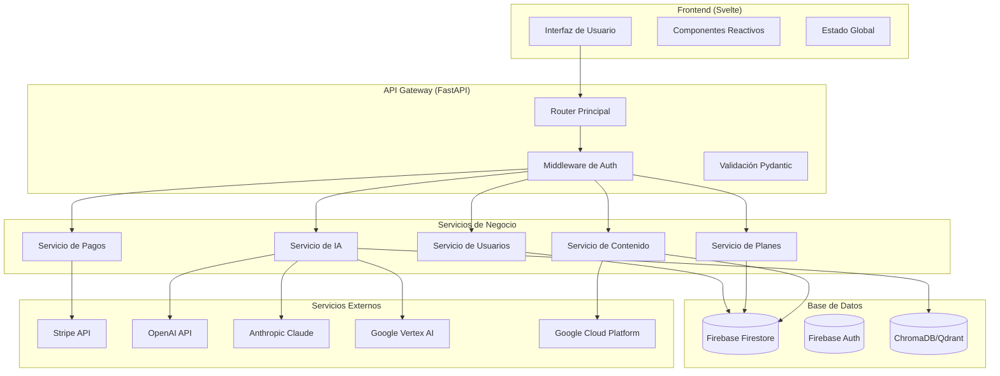
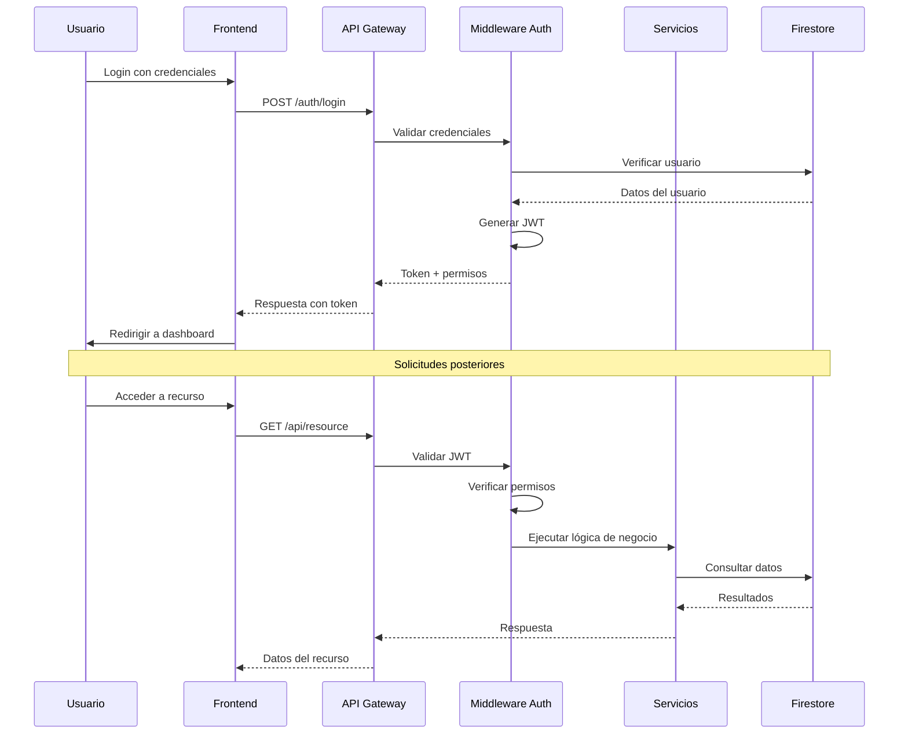
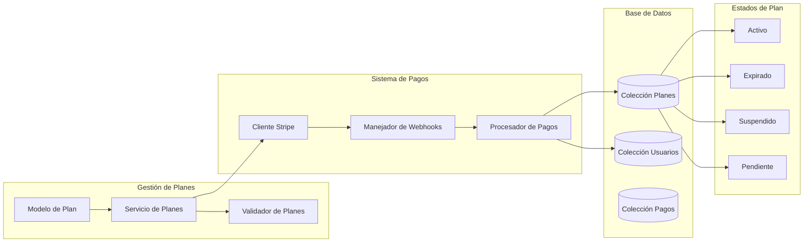
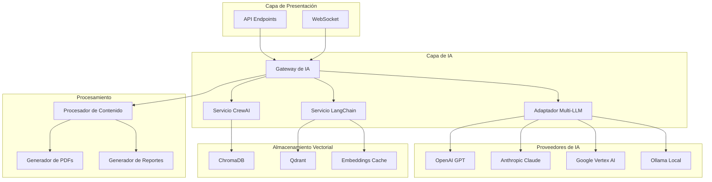
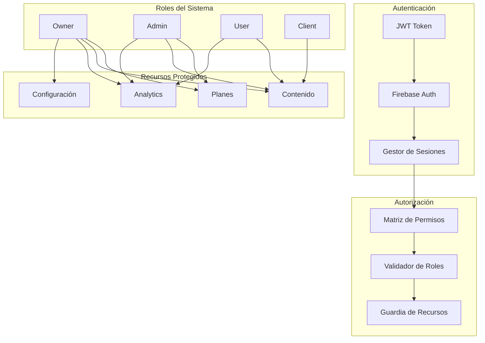
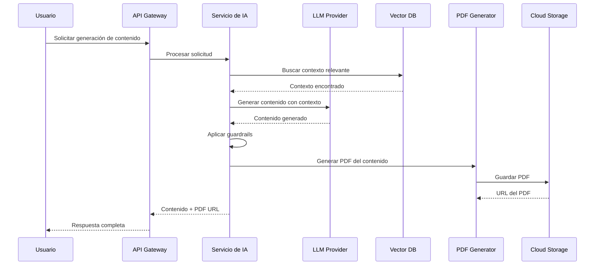
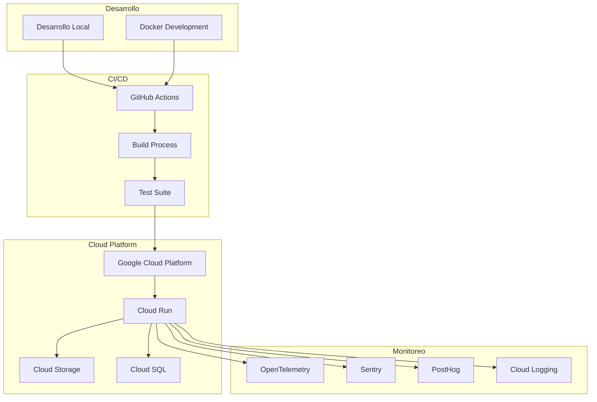
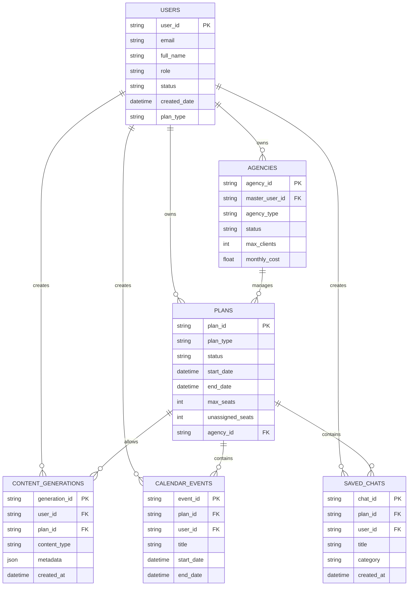

# 🏗️ Diagramas de Arquitectura - FastStrat

## Arquitectura General del Sistema

## Flujo de Autenticación y Autorización

## Sistema de Planes y Suscripciones

## Arquitectura de IA y Generación de Contenido

## Sistema de Seguridad y Permisos

## Flujo de Generación de Contenido

## Deployment y Infraestructura

## Estructura de Base de Datos

