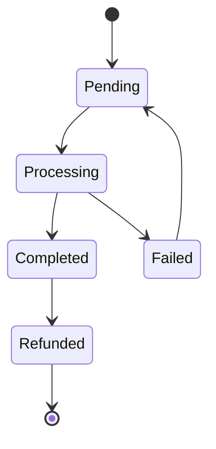

# 🏗️ Documentación Técnica - FastStrat

## Arquitectura del Sistema

### Principios de Diseño

1. **Separación de Responsabilidades**: Cada capa tiene responsabilidades bien definidas
2. **Escalabilidad Horizontal**: Diseño preparado para crecimiento
3. **Seguridad por Defecto**: Autenticación y autorización en cada endpoint
4. **Observabilidad**: Monitoreo completo del sistema
5. **Resiliencia**: Manejo de errores y fallbacks automáticos

### Capas del Sistema

#### 1. Capa de Presentación (Frontend)
- **Framework**: Svelte.js
- **Estado**: Store reactivo centralizado
- **Componentes**: Reutilizables y modulares
- **Rutas**: SPA con navegación dinámica

#### 2. Capa de API (Backend)
- **Framework**: FastAPI
- **Servidor**: Uvicorn ASGI
- **Validación**: Pydantic models
- **Documentación**: OpenAPI/Swagger automática

#### 3. Capa de Servicios
- **UserService**: Gestión de usuarios y autenticación
- **PlanService**: Lógica de planes y suscripciones
- **PaymentService**: Integración con Stripe
- **AIService**: Generación de contenido con IA
- **ContentService**: Gestión de contenido y archivos

#### 4. Capa de Datos
- **Principal**: Firebase Firestore (NoSQL)
- **Autenticación**: Firebase Auth
- **Vectorial**: ChromaDB/Qdrant para embeddings
- **Cache**: Redis para sesiones y datos frecuentes

## Patrones de Diseño Implementados

### 1. Repository Pattern
```python
# Ejemplo conceptual de implementación
class UserRepository:
    def __init__(self, db_client):
        self.db = db_client
        self.collection = "users"
    
    async def create(self, user_data: Dict) -> str:
        # Lógica de creación
        pass
    
    async def get_by_id(self, user_id: str) -> Optional[User]:
        # Lógica de consulta
        pass
    
    async def update(self, user_id: str, data: Dict) -> bool:
        # Lógica de actualización
        pass
```

### 2. Service Layer Pattern
```python
# Ejemplo conceptual de servicio
class UserService:
    def __init__(self, user_repo: UserRepository, auth_service: AuthService):
        self.user_repo = user_repo
        self.auth_service = auth_service
    
    async def create_user(self, user_data: CreateUserRequest) -> UserResponse:
        # Validación de datos
        # Lógica de negocio
        # Creación en repositorio
        # Respuesta formateada
        pass
```

### 3. Factory Pattern para LLMs
```python
# Ejemplo conceptual de factory para LLMs
class LLMFactory:
    @staticmethod
    def create_llm(provider: str, config: Dict) -> BaseLLM:
        if provider == "openai":
            return OpenAILLM(config)
        elif provider == "claude":
            return ClaudeLLM(config)
        elif provider == "vertex":
            return VertexAILLM(config)
        else:
            raise ValueError(f"Provider {provider} not supported")
```

### 4. Observer Pattern para Webhooks
```python
# Ejemplo conceptual de sistema de webhooks
class WebhookObserver:
    def __init__(self):
        self.observers = []
    
    def register(self, event_type: str, handler: Callable):
        self.observers.append((event_type, handler))
    
    def notify(self, event_type: str, data: Dict):
        for event, handler in self.observers:
            if event == event_type:
                handler(data)
```

## Estructura de Base de Datos

### Colecciones Principales

#### Users Collection
```json
{
  "user_id": "string",
  "email": "string",
  "full_name": "string",
  "role": "enum(owner|admin|user|client)",
  "status": "enum(active|inactive|expired|suspended)",
  "plan_type": "enum(trial|basic|premium|enterprise)",
  "created_date": "timestamp",
  "last_login": "timestamp",
  "license_agreements": "array",
  "marketing_opt_in": "boolean"
}
```

#### Plans Collection
```json
{
  "plan_id": "string",
  "plan_type": "enum(trial|basic|premium|enterprise)",
  "status": "enum(active|expired|suspended|pending)",
  "start_date": "timestamp",
  "end_date": "timestamp",
  "max_seats": "integer",
  "unassigned_seats": "integer",
  "members": "array",
  "user_ids": "array",
  "agency_id": "string",
  "features_summary": "object"
}
```

#### Agencies Collection
```json
{
  "agency_id": "string",
  "master_user_id": "string",
  "agency_type": "enum(micro|mini|standard|enterprise)",
  "status": "enum(active|inactive|suspended)",
  "name": "string",
  "client_count": "integer",
  "max_clients": "integer",
  "monthly_cost": "float",
  "annual_cost": "float",
  "clients": "array"
}
```

### Índices Estratégicos

```javascript
// Índices para optimizar consultas frecuentes
{
  "users": [
    { "email": "asc" },
    { "status": "asc", "created_date": "desc" },
    { "plan_type": "asc", "status": "asc" }
  ],
  "plans": [
    { "user_ids": "array-contains" },
    { "agency_id": "asc" },
    { "status": "asc", "end_date": "asc" }
  ],
  "agencies": [
    { "master_user_id": "asc" },
    { "status": "asc" },
    { "agency_type": "asc" }
  ]
}
```

## Sistema de Autenticación y Autorización

### Flujo de Autenticación

1. **Login**: Usuario proporciona credenciales
2. **Validación**: Firebase Auth valida credenciales
3. **Token**: Se genera JWT con claims de usuario
4. **Sesión**: Token se almacena en cliente
5. **Validación**: Cada request valida token en middleware

### Matriz de Permisos

| Recurso | Owner | Admin | User | Client |
|---------|-------|-------|------|--------|
| Planes | CRUD | R | R | R |
| Usuarios | CRUD | CRUD | R | R |
| Contenido | CRUD | CRUD | CRUD | R |
| Analytics | CRUD | CRUD | R | R |
| Configuración | CRUD | R | - | - |

### Middleware de Autorización

```python
# Ejemplo conceptual de middleware
async def require_permission(permission: str):
    def decorator(func):
        @wraps(func)
        async def wrapper(*args, **kwargs):
            # Validar token
            # Verificar permisos
            # Ejecutar función
            pass
        return wrapper
    return decorator
```

## Integración con IA

### Arquitectura Multi-LLM

```python
# Ejemplo conceptual de adaptador multi-LLM
class MultiLLMAdapter:
    def __init__(self):
        self.providers = {
            "openai": OpenAIProvider(),
            "claude": ClaudeProvider(),
            "vertex": VertexAIProvider()
        }
    
    async def generate_content(self, prompt: str, provider: str = "openai") -> str:
        if provider not in self.providers:
            raise ValueError(f"Provider {provider} not supported")
        
        return await self.providers[provider].generate(prompt)
    
    async def generate_with_fallback(self, prompt: str) -> str:
        for provider in self.providers.values():
            try:
                return await provider.generate(prompt)
            except Exception:
                continue
        raise Exception("All providers failed")
```

### Sistema de Guardrails

```python
# Ejemplo conceptual de guardrails
class ContentGuardrails:
    def __init__(self):
        self.filters = [
            ProfanityFilter(),
            ToxicityFilter(),
            BrandSafetyFilter()
        ]
    
    def validate_content(self, content: str) -> ValidationResult:
        for filter in self.filters:
            result = filter.validate(content)
            if not result.is_valid:
                return result
        return ValidationResult(valid=True)
```

## Sistema de Pagos

### Integración con Stripe

```python
# Ejemplo conceptual de integración Stripe
class StripePaymentService:
    def __init__(self, stripe_client):
        self.stripe = stripe_client
    
    async def create_checkout_session(self, plan_data: Dict) -> str:
        session = self.stripe.checkout.Session.create(
            payment_method_types=['card'],
            line_items=[{
                'price': plan_data['stripe_price_id'],
                'quantity': plan_data['quantity']
            }],
            mode='subscription',
            success_url='https://app.com/success',
            cancel_url='https://app.com/cancel'
        )
        return session.id
    
    async def handle_webhook(self, event: Dict) -> bool:
        if event['type'] == 'checkout.session.completed':
            return await self.process_successful_payment(event)
        elif event['type'] == 'invoice.payment_failed':
            return await self.process_failed_payment(event)
        return True
```

### Estados de Pago



## Generación de PDFs

### Arquitectura del Generador

```python
# Ejemplo conceptual de generador de PDFs
class PDFGenerator:
    def __init__(self):
        self.templates = {
            "report": ReportTemplate(),
            "presentation": PresentationTemplate(),
            "summary": SummaryTemplate()
        }
    
    def generate_pdf(self, content: str, template: str, options: Dict) -> bytes:
        template_instance = self.templates[template]
        return template_instance.render(content, options)
    
    def generate_master_pdf(self, reports: List[Dict]) -> bytes:
        # Combinar múltiples reportes en un solo PDF
        pass
```

### Estructura de Templates

```python
# Ejemplo conceptual de template
class ReportTemplate:
    def __init__(self):
        self.styles = self.setup_styles()
        self.layout = self.setup_layout()
    
    def setup_styles(self):
        return {
            "title": ParagraphStyle(
                name="Title",
                fontSize=24,
                spaceAfter=30,
                alignment=TA_CENTER
            ),
            "heading": ParagraphStyle(
                name="Heading",
                fontSize=16,
                spaceAfter=12,
                spaceBefore=12
            )
        }
    
    def render(self, content: str, options: Dict) -> bytes:
        # Lógica de renderizado
        pass
```

## Monitoreo y Observabilidad

### Métricas Clave

1. **Performance**
   - Latencia de API (p95, p99)
   - Throughput (requests/segundo)
   - Tiempo de respuesta de IA

2. **Business**
   - Usuarios activos
   - Generaciones de contenido
   - Conversiones de pago

3. **Infrastructure**
   - Uso de CPU/Memory
   - Errores por endpoint
   - Disponibilidad del servicio

### Logging Strategy

```python
# Ejemplo conceptual de logging
class StructuredLogger:
    def __init__(self):
        self.logger = logging.getLogger(__name__)
    
    def log_api_request(self, endpoint: str, user_id: str, duration: float):
        self.logger.info("API Request", extra={
            "endpoint": endpoint,
            "user_id": user_id,
            "duration_ms": duration * 1000,
            "timestamp": datetime.utcnow().isoformat()
        })
    
    def log_ai_generation(self, model: str, tokens_used: int, cost: float):
        self.logger.info("AI Generation", extra={
            "model": model,
            "tokens_used": tokens_used,
            "cost_usd": cost,
            "timestamp": datetime.utcnow().isoformat()
        })
```

## Deployment y DevOps

### Pipeline CI/CD

```yaml
# Ejemplo conceptual de GitHub Actions
name: Deploy to Production

on:
  push:
    branches: [main]

jobs:
  test:
    runs-on: ubuntu-latest
    steps:
      - uses: actions/checkout@v2
      - name: Run Tests
        run: pytest tests/
  
  deploy:
    needs: test
    runs-on: ubuntu-latest
    steps:
      - name: Deploy to Cloud Run
        run: |
          gcloud run deploy faststrat-api \
            --image gcr.io/project/faststrat-api \
            --platform managed \
            --region us-central1 \
            --allow-unauthenticated
```

### Configuración de Entornos

```python
# Ejemplo conceptual de configuración
class Config:
    def __init__(self):
        self.environment = os.getenv("ENVIRONMENT", "development")
        self.database_url = os.getenv("DATABASE_URL")
        self.openai_api_key = os.getenv("OPENAI_API_KEY")
        self.stripe_secret_key = os.getenv("STRIPE_SECRET_KEY")
    
    @property
    def is_production(self) -> bool:
        return self.environment == "production"
    
    @property
    def debug_enabled(self) -> bool:
        return not self.is_production
```

## Consideraciones de Seguridad

### Protección de Datos

1. **Encriptación en Tránsito**: TLS 1.3 para todas las comunicaciones
2. **Encriptación en Reposo**: Datos sensibles encriptados en Firestore
3. **Validación de Entrada**: Pydantic para validación estricta
4. **Rate Limiting**: Protección contra abuso de APIs
5. **Audit Logs**: Registro de todas las acciones críticas

### Mejores Prácticas

```python
# Ejemplo conceptual de validación de seguridad
class SecurityValidator:
    @staticmethod
    def validate_email(email: str) -> bool:
        # Validación de formato de email
        pass
    
    @staticmethod
    def sanitize_input(input_str: str) -> str:
        # Sanitización de entrada de usuario
        pass
    
    @staticmethod
    def validate_permissions(user_id: str, resource: str, action: str) -> bool:
        # Validación de permisos específicos
        pass
```

## Optimizaciones de Performance

### Caching Strategy

```python
# Ejemplo conceptual de sistema de cache
class CacheManager:
    def __init__(self, redis_client):
        self.redis = redis_client
        self.default_ttl = 3600  # 1 hora
    
    async def get_or_set(self, key: str, getter_func: Callable, ttl: int = None) -> Any:
        # Intentar obtener del cache
        cached_value = await self.redis.get(key)
        if cached_value:
            return json.loads(cached_value)
        
        # Obtener valor fresco
        fresh_value = await getter_func()
        
        # Guardar en cache
        await self.redis.setex(
            key, 
            ttl or self.default_ttl, 
            json.dumps(fresh_value)
        )
        
        return fresh_value
```

### Optimización de Consultas

```python
# Ejemplo conceptual de optimización de consultas
class OptimizedQueryService:
    def __init__(self, firestore_client):
        self.db = firestore_client
    
    async def get_user_with_plans(self, user_id: str) -> Dict:
        # Consulta optimizada que obtiene usuario y planes en una sola operación
        user_ref = self.db.collection('users').document(user_id)
        plans_ref = self.db.collection('plans').where('user_ids', 'array-contains', user_id)
        
        # Ejecutar consultas en paralelo
        user_doc, plans_docs = await asyncio.gather(
            user_ref.get(),
            plans_ref.get()
        )
        
        return {
            'user': user_doc.to_dict(),
            'plans': [doc.to_dict() for doc in plans_docs]
        }
```

Esta documentación técnica proporciona una visión completa de la arquitectura implementada en FastStrat, mostrando las decisiones técnicas, patrones de diseño y consideraciones de escalabilidad y seguridad. 